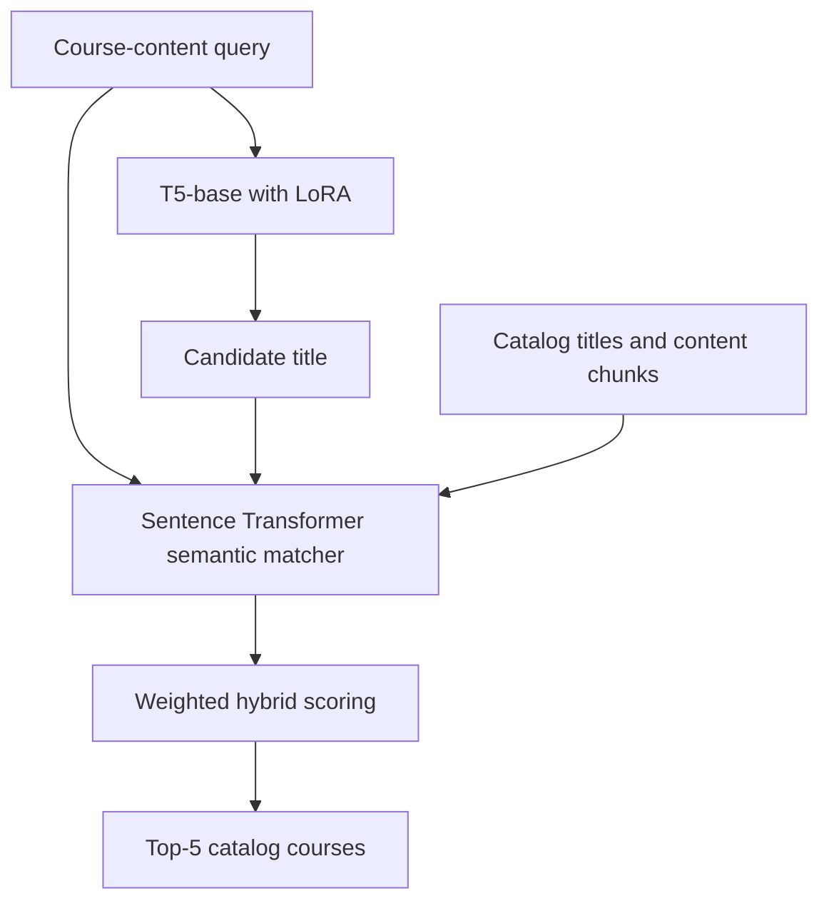

# Masar · HyDE Recommender Service

**Course retrieval that combines title generation with semantic matching against a fixed catalog.**

This service is the recommendation component of the Masar learning platform. It uses **T5-base adapted with LoRA** to propose a course title from content, then combines that title with semantic evidence to retrieve existing catalog courses. FastAPI exposes the retrieval pipeline to the Laravel backend.

> **Documentation status:** This draft is based on the Masar project report and the shared architecture description. The linked repository's source was not accessible during preparation. Verify the runtime entry point, model assets, data paths, configuration, and API schemas against the current code before publishing this README.

## Why this approach?

The project initially explored classification and clustering. Treating individual course titles as classes was difficult because the catalog contained many distinct titles with limited examples per course. Clustering helped organize related courses, but assigning a group did not identify the specific catalog entry to return.

The task was therefore reframed as **semantic retrieval**: given course-related content, rank the most relevant courses already present in the catalog.

## T5, LoRA, HyDE, and the hybrid system

These names refer to different parts of the design:

| Component | Role in Masar |
| --- | --- |
| **T5-base** | The text-to-text model that generates a candidate course title. |
| **LoRA — Low-Rank Adaptation** | The training method used to adapt T5 while keeping its original weights frozen and training small low-rank updates. |
| **HyDE — Hypothetical Document Embeddings** | The retrieval idea that motivates generating useful text before searching for real items. |
| **Sentence Transformers** | The semantic encoder used to represent titles and content as vectors. The documented model is `all-MiniLM-L6-v2`. |
| **Hybrid scoring** | The combination of title and content similarity signals into a final ranking. |

### How LoRA is used

LoRA adapts the pretrained generator to the course-title task without updating all of T5's original parameters. The project uses trainable low-rank updates, which reduce the number of trainable parameters and training-memory requirements relative to full fine-tuning.

The adapter works with its corresponding base model; it is not a standalone replacement for T5. Inference requires compatible base-model weights and the trained adapter configuration and weights.

### How the design relates to HyDE

Original HyDE generates a hypothetical document from a query, embeds that generated document, and uses its representation to retrieve real documents.

Masar uses a **HyDE-inspired adaptation**: T5 generates a candidate course title, and the system combines evidence from this title with evidence from the original content. The final result is selected from the known catalog.

The generated title is an intermediate search signal. It does not create a new catalog course. This supervised, task-specific hybrid pipeline should be distinguished from the original zero-shot HyDE method.

## Retrieval pipeline



The documented matcher splits course content into smaller chunks and combines three signals:

| Signal | Comparison |
| --- | --- |
| Title similarity | Generated title versus a catalog course's title. |
| Query-to-content similarity | Input content versus that course's content chunks. |
| Generated-title-to-content similarity | Generated title versus that course's content chunks. |

Chunk matches are aggregated to obtain course-level scores. The three scores are then combined with weights to rank candidates. Check the implementation for the current chunk size, aggregation rule, normalization, and weights rather than assuming that settings from an earlier experiment remain active.

### The 25% / 75% experimental split

The project report describes an experimental setup in which **25% of course content is supplied to the generator**, while the remaining **75% is used for semantic matching** and is withheld from the generator's input.

This content partition is specific to the project's experimental design. It is separate from the train/validation/test split and does not, on its own, guarantee the absence of data leakage. Check how the deployed service constructs queries and catalog content before applying this partition to API requests.

## Technology

| Technology | Purpose |
| --- | --- |
| Python and FastAPI | Inference service and HTTP interface. |
| PyTorch and Transformers | Load and run the T5 generator. |
| PEFT / LoRA | Load the task-specific adaptation. |
| Sentence Transformers | Encode text for semantic matching. |
| Uvicorn | ASGI server for local development. |
| Laravel and Next.js | Backend coordination and learner-facing interface in the wider platform. |

## Local setup

### 1. Clone and create an environment

```bash
git clone https://github.com/shahdzaa/recommender-service-HyDE.git
cd recommender-service-HyDE
python -m venv .venv
```

Activate it on macOS or Linux:

```bash
source .venv/bin/activate
```

Or in Windows PowerShell:

```powershell
.\.venv\Scripts\Activate.ps1
```

Use the Python version and dependency manifest declared by the repository. If the manifest is `requirements.txt`, install it with:

```bash
python -m pip install -r requirements.txt
```

### 2. Prepare model and catalog assets

Check the loading code and provide the assets it expects:

- The compatible T5-base model and tokenizer.
- The trained LoRA adapter weights and configuration.
- The `all-MiniLM-L6-v2` semantic encoder.
- The course catalog, including the titles and content used for retrieval.
- Any saved embeddings, indexes, or scoring settings explicitly loaded by this version.

Asset paths, catalog filenames, required columns, and whether downloads happen at startup were not verified. Use the actual paths and schemas from the repository. Do not assume that cloning the source also downloads trained weights or the dataset.

### 3. Start the service

The Masar development architecture assigns this service port **8002**. Replace `YOUR_MODULE` with the actual Python import path containing the FastAPI instance named `app`:

```bash
python -m uvicorn YOUR_MODULE:app --host 127.0.0.1 --port 8002 --reload
```

Use `main:app` only if `main.py` defines that instance. An application factory or a differently named instance requires an adjusted command.

If the standard FastAPI documentation routes are enabled:

- [Swagger UI](http://127.0.0.1:8002/docs)
- [OpenAPI schema](http://127.0.0.1:8002/openapi.json)

The reload flag is for local development. Model and catalog loading can make each restart expensive.

## Documented API contract

### `POST /api/recommend/`

The project report describes a request with a `syllabus_text` field and a response containing a ranked `recommendations` list. Verify the exact route, slash behavior, and item schema against the implementation.

Illustrative request based on that documented contract:

```json
{
  "syllabus_text": "Python variables, conditional statements, loops, functions, and introductory problem solving."
}
```

The intended output is the **five highest-ranked catalog courses**. The current response fields, including whether titles, identifiers, or similarity scores are returned, must be taken from the API schema. A similarity score should not be interpreted as a calibrated probability that a course is suitable for a learner.

## Integration with Masar

The Next.js interface communicates with Laravel. After processing a placement test, Laravel assembles the relevant topic text and calls the recommender. It then returns the recommendation list alongside the test result.

The project report describes preserving the saved test result if the recommendation service fails. Test creation and scoring belong to Laravel; question generation is handled by the separate [AI Quiz Service](https://github.com/shahdzaa/ai-quiz-service).

## Evaluation

The project evaluates retrieval with:

| Metric | Meaning |
| --- | --- |
| **Top-1 accuracy** | The target course is ranked first. |
| **Top-5 accuracy** | The target course appears among the first five results. |
| **MRR** | Mean reciprocal rank of the target course; specify any rank cutoff used by the evaluation. |

Published scores should identify the evaluated checkpoint, catalog, data partition, and evaluation script. Metrics from different experimental versions should not be mixed. No benchmark result is claimed for the current repository without verifying its corresponding evaluation artifacts.

## Checks before finalizing this README

- Confirm the dependency versions and ASGI entry point.
- Document the exact model, adapter, tokenizer, and catalog paths.
- Confirm the current scoring weights, chunking settings, and device selection.
- Verify the HTTP contract and replace illustrative material with a tested example.
- Link training and evaluation scripts only after confirming they exist in this repository.

## References and related service

- [LoRA: Low-Rank Adaptation of Large Language Models](https://arxiv.org/abs/2106.09685)
- [Precise Zero-Shot Dense Retrieval without Relevance Labels — HyDE](https://arxiv.org/abs/2212.10496)
- [Masar · AI Quiz Service](https://github.com/shahdzaa/ai-quiz-service)

